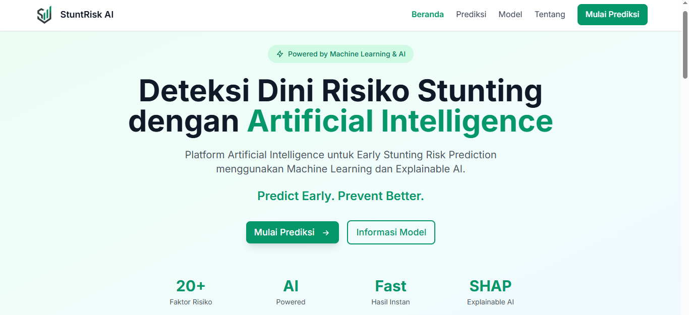
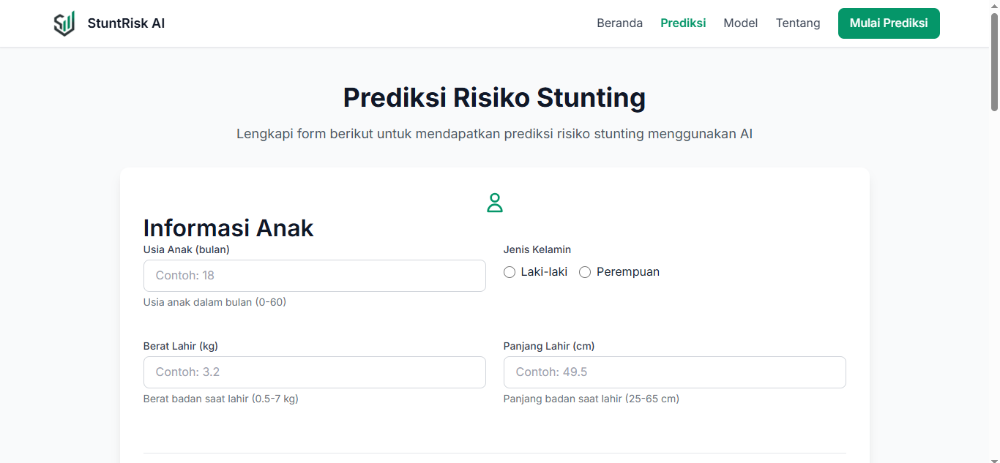
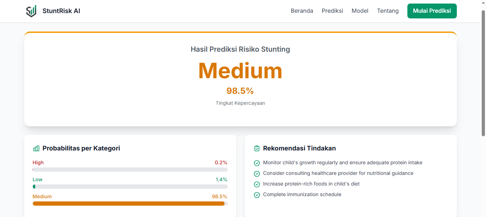
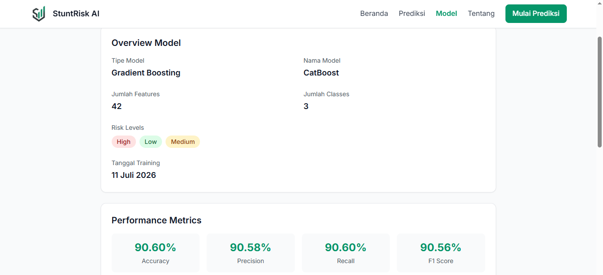

<div align="center">
  

  # StuntRisk AI

  **End-to-End AI System for Early Stunting Risk Prediction**

  *Synthetic Data • Explainable AI • FastAPI • Modern Web Application*

  [](https://python.org)
  [](https://fastapi.tiangolo.com)
  [](https://catboost.ai)
  [](https://shap.readthedocs.io)
  [](LICENSE)

</div>


---

## Overview

This project is a **professional-grade, end-to-end AI system** that demonstrates the complete cycle of AI development:

1. **Synthetic Dataset Generation** - realistic data built from probability distributions, feature relationships, risk rules, and configurable noise
2. **Exploratory Data Analysis** - statistical analysis, visualizations, and insight generation
3. **Machine Learning Pipeline** - multi-model training, cross-validation, hyperparameter tuning, and model selection
4. **Explainable AI** - SHAP based global and local explanations
5. **FastAPI Backend** - REST API + Jinja2 server-side rendering
6. **Modern Web Frontend** - HTML5/CSS3/Tailwind CSS/JS with responsive design
7. **Production Deployment** - deployed on Render, single service

> **Focus:** This project prioritizes demonstrating the complete AI lifecycle pipeline over achieving maximum prediction accuracy. The dataset is entirely synthetic, built to reflect realistic relationships described in public health literature.

---

## Features

- **Realistic Synthetic Data** - generated with dependency graphs, not random noise
- **Multiple ML Models** - XGBoost, CatBoost, LightGBM, Logistic Regression
- **Explainable AI** - SHAP values for every prediction
- **FastAPI Backend** - async, type-safe, documented
- **Modern Frontend** - responsive UI served via Jinja2 templates
- **Deployment Ready** - Render-compatible, single service
- **Fully Tested** - pytest-based test suite
- **Reproducible** - seeded random generation, YAML configuration

---

## Architecture

```
Browser
   │
   ▼
Render (Cloud Hosting)
   │
   ▼
FastAPI Application
   ├── Jinja2 Templates (HTML Pages)
   ├── Static Files (CSS / JS / Images)
   └── ML Inference Engine
          │
          ▼
   Trained Model + SHAP Explainer
```

---

## Screenshots

<div align="center">
   
   
</div>

<div align="center">
   
   
</div>

---

## Folder Structure

```
early-stunting-risk-ai/
│
├── docs/                          # Project documentation
│   ├── architecture.md
│   ├── dataset.md
│   ├── synthetic_generator.md
│   ├── model.md
│   ├── api.md
│   └── deployment.md
│
├── synthetic_data/                # Synthetic Data Platform
│   ├── config/                    # YAML configuration files
│   │   ├── generator.yaml
│   │   ├── distributions.yaml
│   │   ├── relationships.yaml
│   │   ├── risk_rules.yaml
│   │   ├── validation.yaml
│   │   └── export.yaml
│   │
│   ├── src/                       # Source code
│   │   ├── core/                  # Core pipeline components
│   │   ├── generators/            # Feature-specific generators
│   │   ├── engines/               # Relationship, Risk, Noise engines
│   │   ├── validators/            # Data validation modules
│   │   ├── exporters/             # CSV, Metadata, Statistics exporters
│   │   ├── reports/               # HTML report generators
│   │   └── utils/                 # Logger, constants, utilities
│   │
│   ├── output/                    # Generated datasets (git-ignored)
│   ├── reports/                   # Generated HTML reports (git-ignored)
│   └── README.md
│
├── notebooks/                     # Jupyter notebooks (EDA, experiments)
│
├── model/                         # ML artifacts
│   ├── trained_models/
│   ├── artifacts/
│   ├── metrics/
│   └── explainability/
│
├── backend/                       # FastAPI application
│   ├── app/
│   ├── routes/
│   ├── services/
│   ├── schemas/
│   ├── templates/
│   ├── static/
│   └── main.py
│
├── deployment/                    # Deployment configuration
├── tests/                         # Test suite
├── assets/                        # Project assets (screenshots, diagrams)
│
├── README.md
├── LICENSE
├── requirements.txt
├── requirements-dev.txt
├── pyproject.toml
└── .gitignore
```

---

## Synthetic Dataset

The dataset contains **10.000 synthetic records** representing children under 5 years old with the following feature groups:

| Group | Features |
|-------|---------|
| **Child** | `age_month`, `gender`, `birth_weight`, `birth_length` |
| **Mother** | `mother_age`, `mother_education`, `mother_working` |
| **Father** | `father_education`, `father_working` |
| **Household** | `family_income`, `sanitation`, `clean_water`, `electricity`, `house_density` |
| **Nutrition** | `exclusive_breastfeeding`, `protein_intake`, `vitamin_intake` |
| **Healthcare** | `immunization`, `diarrhea_history`, `healthcare_access` |
| **Target** | `risk_score` (0–100), `risk_level` (Low/Medium/High) |

---

## Machine Learning Pipeline

| Model | Cross-Val Accuracy | Notes |
|-------|-------------------|-------|
| CatBoost | 88.91% | Handles categoricals natively |
| Logistic Regression | 88.78% | Baseline |
| LightGBM | 88.48% | Fast training, low memory |
| XGBoost | 88.28% | Gradient boosting, feature importance |
| Random Forest | 87.70% | Good generalization |
| Extra Trees | 86.94% | Faster training |

*Metrics are populated after training. Best model is selected automatically.*

---

## Backend

**FastAPI** with the following endpoints:

| Method | Path | Description |
|--------|------|-------------|
| `GET` | `/` | Landing page |
| `GET` | `/prediction` | Prediction form |
| `POST` | `/predict` | Run inference |
| `GET` | `/about` | About the project |
| `GET` | `/model-info` | Model information |
| `GET` | `/health` | Health check |
| `GET` | `/docs` | Swagger documentation |

---

## Quickstart

### Prerequisites

- Python 3.12 (gunakan 3.12.x; model artifact tidak kompatibel dengan Python/dependency yang lebih baru)
- pip

### Installation

```bash
# Clone the repository
git clone https://github.com/hamzbriel/early-stunting-risk-ai.git
cd early-stunting-risk-ai

# Create virtual environment
python -m venv .venv
source .venv/bin/activate  # Windows: .venv\Scripts\activate

# Install dependencies
pip install -r requirements.txt
```

### Generate Synthetic Dataset

```bash
cd synthetic_data
python src/main.py
```

Output will be saved to `synthetic_data/output/`.

### Run the API

```bash
cd backend
uvicorn main:app --reload --port 8000
```

Visit `http://localhost:8000`

---

## Deployment

This application is deployed on **Render** as a single service (Frontend + Backend unified).

See [`docs/deployment.md`](docs/deployment.md) for the complete guide.

---

## API Documentation

Full API docs are available at `http://localhost:8000/docs` (Swagger) when running locally.

See [`docs/api.md`](docs/api.md) for detailed documentation.

---

## License

This project is licensed under the **MIT License** - see [LICENSE](LICENSE) for details.

---

<div align="center">
   <br>
   

   ### Hamzah Abdillah Gabriela

   **Teknik Informatika - Universitas Padjadjaran**

   *AI/ML enthusiast building end-to-end intelligent systems*

   [](https://linkedin.com/in/hamzbriel)
   [](https://github.com/hamzbriel)
   [](https://www.kaggle.com/hamzbriel)
   [](https://instagram.com/hamzbriel)

   ---

   *Built as a professional AI portfolio project demonstrating end-to-end ML system development*
</div>